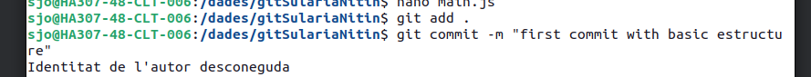
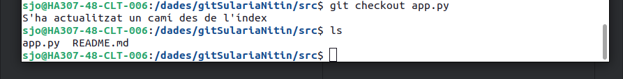

# Resumen de la Actividad: Remoto y repaso de comandos anteriores

En esta actividad, me he encargado de practicar la sincronización y administración de un repositorio Git, así como de manejar ramas, resolver diferencias y trabajar con repositorios locales y remotos.

## Parte 1: Preparación del Proyecto
Primero, creé un directorio llamado `GitApellido1Nombre2425` en mi carpeta principal. Dentro de este, creé una subcarpeta llamada `src` y un archivo `README.md` donde escribí una breve descripción del proyecto. Utilicé el terminal para realizar todas estas acciones.

Luego, inicialicé Git en el directorio, agregué un archivo `.gitignore` para ignorar archivos de log y carpetas temporales, y creé la estructura básica de la web con `index.html`, `style.css` y `main.js`. Finalmente, hice un `git add` de todos los archivos y realicé un commit inicial con el mensaje: 

## Parte 2: Colaboración en Equipo
En la segunda parte de la actividad, configuré un repositorio remoto en GitHub. Creé un nuevo repositorio y analicé las diferencias entre crear un repositorio con un archivo `README.md` y uno sin él. Al crear un repositorio con `README.md`, se proporciona una descripción inicial del proyecto, lo que puede ser útil para otros colaboradores. En cambio, si se crea sin este archivo, el repositorio carecerá de una introducción clara, lo que podría dificultar la comprensión del propósito del proyecto.

Después de crear el repositorio en GitHub, vinculé el repositorio remoto con mi repositorio local utilizando el comando `git remote add origin <URL_del_repositorio>`. Esto me permitió sincronizar los cambios entre ambos repositorios.

A continuación, creé una nueva rama llamada `feature/documentacion` y me cambié a ella. En esta rama, creé un archivo `docs.md` en la raíz del proyecto, donde escribí un resumen de las funcionalidades del proyecto. Luego, realicé un commit con el mensaje: 

Después de esto, volví a la rama `main` y utilicé el comando `git diff` para comparar las diferencias entre la rama `main` y `feature/documentacion`, lo que me permitió revisar los cambios realizados.

## Parte 3: Gestión de Archivos y Cambios
En la tercera parte, me enfoqué en la gestión de archivos y cambios. Creé un nuevo archivo llamado `src/app.py`, en el que incluí un mensaje básico que imprime "Hola, mundo!". Realicé un `git add` y un `commit` para registrar este nuevo archivo en el repositorio. Para verificar el estado del repositorio, utilicé el comando `git status`, y también visualicé el historial de commits con `git log`.

Además, borré el archivo `src/app.py` utilizando un comando de terminal y luego lo recuperé con el comando `git checkout -- src/app.py`, lo que me permitió restaurar el archivo a su estado anterior.

Finalmente, desde la rama `main`, realicé un merge de la rama `feature/documentacion`, integrando los cambios realizados en la documentación. Verifiqué los cambios en el historial de commits utilizando `git log`.

## Parte 4: Entrega del Proyecto
Para concluir la actividad, me aseguré de que todos los archivos estuvieran en su lugar y realicé un `push` final al repositorio remoto para sincronizar todos los cambios. También eliminé la rama `feature/documentacion` para mantener el repositorio limpio y organizado.

Por último, exploré el proyecto desde el terminal, utilizando comandos de Linux para listar el contenido de cada directorio y mostrar el contenido de los archivos finales. Esta actividad me ha proporcionado una comprensión más profunda del uso de Git y la gestión de proyectos en equipo, así como la importancia de documentar adecuadamente el trabajo en Markdown.

### Captura 1

### Captura 2

### Captura 27

### Captura 15

### Captura 21

### Captura 26

### Captura 3

### Captura 12

### Captura 9

### Captura 8

### Captura 31

### Captura 6

### Captura 24

### Captura 4

### Captura 7

### Captura 10

### Captura 11

### Captura 13

### Captura 14

### Captura 16

### Captura 17

### Captura 18

### Captura 19

### Captura 22

### Captura 25

### Captura 28

### Captura 29

### Captura 30

### Captura 33

### Captura 34

### Captura 35

### Captura 36

### Captura 37

### Captura 23

